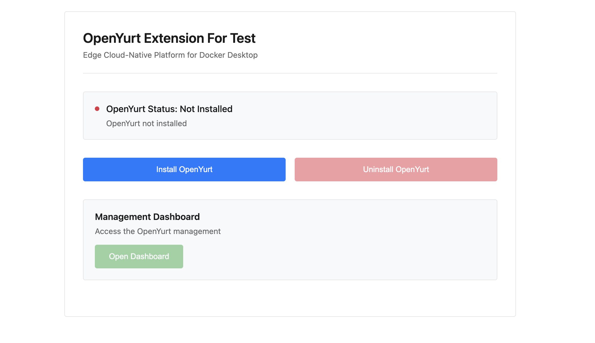

# OpenYurt Extension

A simple, minimal, and **one-click** way to install and run [OpenYurt](https://openyurt.io).

## Features
- **One-Click Deployment** — Installs `yurt-manager`, `yurt-hub`, and all required dependencies instantly.
- **Built-In Dashboard** — Access the Yurt Dashboard directly inside Docker Desktop. (Not yet implemented)
- **Local Dev & Testing** — Spin up a single-node OpenYurt cluster for development or demos.
- **Automated Scripts** — Handles installation, configuration, and verification automatically.

---

## Demo


## Docker Extension
To turn this project into a Docker Desktop Extension:
```bash
docker extension init openyurt-ext
# Replace the generated code with this project’s code
docker build -t openyurt-ext .
docker extension install openyurt-ext
```

### Run Locally
```bash
make run
```
